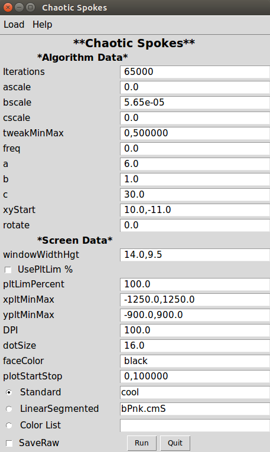
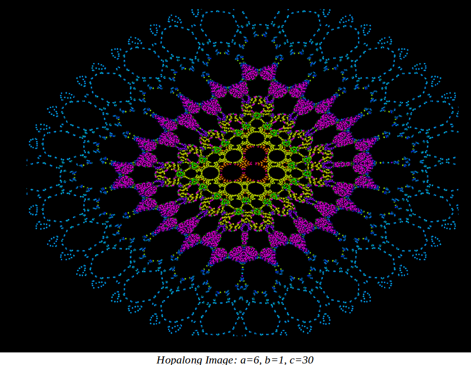
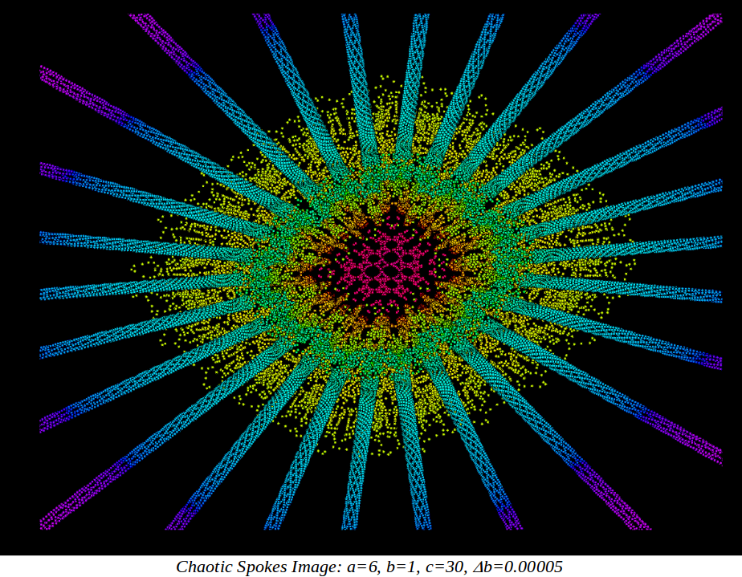
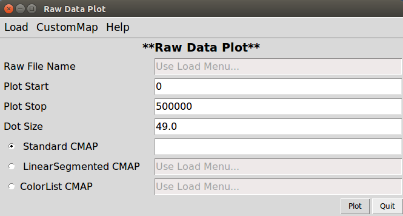
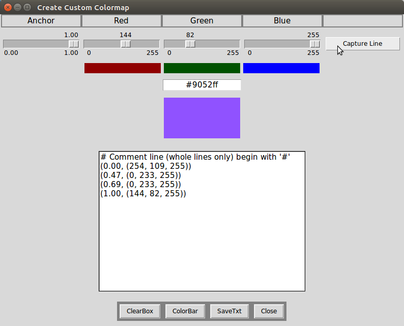
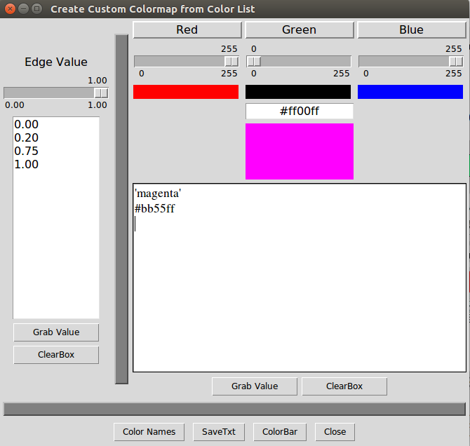
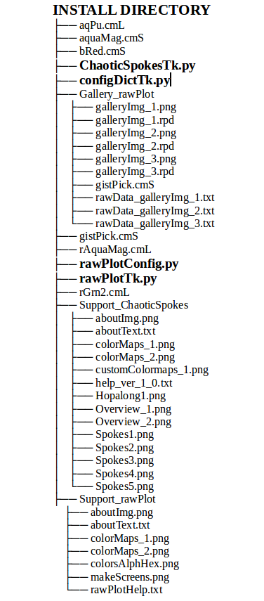

# Chaotic Spokes Program

The Chaotic Spokes generator was derived from the Martin Attractor, or Hopalong, from Dr. Barry Martin that was described in a 1986 edition of Scientific America. The original Hopalong program operated on points in the xy-plane, "hopping" from one ordered pair to the next via the following coupled equations:

where a, b, and c are constants. The Chaotic Spokes generator retains the core Hopalong algorithm, but provides a variety of methods for "tweaking" the x and y calculations. This tweaking results in spoke-like patterns that emerge from an initial (usually) Hopalong-like pattern. Small differences in the tweaking parameters often generate completely different patterns of "spokes". 

A primary tweak is the modification of the a, b, and c parameters that are constants in the original Hopalong calculations:

Additional features that my be manipulated via an loadable  Configuration Data dictionary, and/or through the program GUI, include: 
-  Number of iterations to perform
-  The Hopalong a, b, c initial values
-  The a, b, c tweaking factors
-  Initial (x,y) location
-  A rotation of the calculated (x,y) point relative to the x-axis
-  An iteration range to apply the a, b, c tweaking factors
-  Sine wave applied against the b tweaking factor
-  Plot limits in display window, which performs image zooming
-  Selection of a "standard" Matplotlib colormap
-  Selection of a user's custom colormap definition
-  Ability to save an image, its raw data, and its data parameters
 
 A picture of the main screen is shown below:

 
 
 The following is the rendering of a legacy Hopalong image. Note the parameters attached to the image.
 
 
 Altering the Hopalong b parameter with a tiny multiplier results in a Chaotic Spokes image.
 
 
# RawPlot Program

The Raw Plot program was originally designed to manipulate raw data files generated by the Chaotic Spokes program. However, the program can load and plot any two-column (x,y) data file and plot/colorize the data. A picture of the main screen is shown below:

The main program allows the user:
1) Load the raw data file.
2) Set/modify the row of data to start/stop the plotting.
3) Set a radio button selection for either a standard Matplotlib colormap, or a custom-made colormap.
4) Set the name of the standard colormap.
5) Load, update, or create a custom colormap file.

Two different kinds of custom colormaps may be built from scratch: Linear Segmented colormaps; and, colormaps from Color List. 

A picture of the screen for building a Linear Segmented colormap is shown below: 

This screen allows the user to manipulate RGB sliders to create a color. Anchor points, from 0.0->1.0, specify the beginning and/or ending points of a custom map section. When desired, the ColorBar button will show the user the complete mapping. The SaveTxt button will then save the text box contents to a file. The newly formed colormap may be subsequently utilized via the main GUI for use on the next plot, or used by the Chaotic Spokes program.

A picture of the screen for building a colormap from a Color List is shown below:
 

This type of colormap has abrupt changes between colors. The process requires specification of edges, two of which define the range of a color. The colors can either be a name of a color, or its RGB hex value derived by the RGB sliders. Several restrictions to this process apply: the first/last edge values must be 0.0 and 1.0; there must be one more edge value than colors. For reference, the Color Names button brings up a list of allowable color names. The function of the ColorBar and SaveTxt buttons function identically to the creation of a Linear Segmented colormap.

# Program Environment
The current Chaotic Spokes program was written for the Python3 environment on a Linux platform. 

The program was written and extensively tested on a Dell XPS-8700 desktop computer using Ubuntu 16.04 LTS 64-bit with Nvidia GeForce GT 635 graphics. Additional testing was performed on an HP laptop using Linux Mint 18.1 Serena 64-bit with AMD Radeon R4/R5 Graphics.

A version that operates on the Windows 10 platform has also been created and tested on the same laptop.

# Dependencies
Python3
Matplotlib
Tkinter
NumPy
Pillow (PIL fork)  

## Installation/Usage
Download the package to your desired Install Directory and unzip the file. The Chaotic Spokes program can then be run on a Linux platform by opening a terminal, changing to your Install Directory, and entering the following:

	python3 ChaoticSpokesTk.py
	
Alternatively, make the ChaoticSpokesTk.py executable, and run the script directly:

	chmod +x ./ChaoticSpokesTk.py
	./ChaoticSpokesTk.py

On the Windows 10 platform, first open a PowerShell window, change to your Install Directory and enter:

	python ChaoticSpokesTk.py

The same steps apply to the rawPlotTk.py script.

The directory structure of the two scripts and their support files follows:

  

Several custom colormap files (cmS and cmL extensions) are provided. Also, several raw data files (txt extension) are provided in the Gallery_rawPlot folder, along with "raw plot data" (rpd extension) files. (The rpd files contain summary information to reproduce the images in the Gallery folder.) None of these files are required for execution of the two scripts. However, the remaining folders/files must be kept in the shown structure to provide proper program execution.
